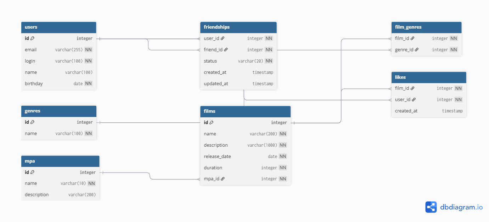

# Filmorate - REST API для фильмов и пользователей

## 🎬 Описание проекта
**Filmorate** — это бэкенд-сервис для работы с фильмами, оценками пользователей и социальными связями. Сервис позволяет добавлять фильмы и пользователей, ставить лайки, добавлять в друзья и получать рекомендации на основе популярности.

---

## 🚀 Функциональность

### 🎥 Фильмы (`/films`)

| Метод | Эндпоинт | Описание |
|-------|----------|----------|
| `GET` | `/films` | Получить все фильмы |
| `GET` | `/films/{id}` | Получить фильм по ID |
| `POST` | `/films` | Создать новый фильм |
| `PUT` | `/films` | Обновить фильм |
| `PUT` | `/films/{id}/like/{userId}` | Поставить лайк |
| `DELETE` | `/films/{id}/like/{userId}` | Убрать лайк |
| `GET` | `/films/popular?count={count}` | Топ N популярных фильмов |

### 👥 Пользователи (`/users`)

| Метод | Эндпоинт | Описание |
|-------|----------|----------|
| `GET` | `/users` | Получить всех пользователей |
| `GET` | `/users/{id}` | Получить пользователя по ID |
| `POST` | `/users` | Создать нового пользователя |
| `PUT` | `/users` | Обновить пользователя |
| `PUT` | `/users/{id}/friends/{friendId}` | Добавить в друзья |
| `DELETE` | `/users/{id}/friends/{friendId}` | Удалить из друзей |
| `GET` | `/users/{id}/friends` | Получить список друзей |
| `GET` | `/users/{id}/friends/common/{otherId}` | Получить общих друзей |

---

## 📋 Модели данных

### 🎬 Фильм (Film)
```json
{
  "id": 1,
  "name": "Интерстеллар",
  "description": "Фантастический фильм о путешествиях в космосе",
  "releaseDate": "2014-10-26",
  "duration": 169,
  "likes": [1, 2, 3]
}
```

### 👤 Пользователь (User)
```json
{
  "id": 1,
  "email": "user@example.com",
  "login": "userlogin",
  "name": "Имя пользователя",
  "birthday": "1990-01-01",
  "friends": [2, 3, 4]
}
```

---

## ✅ Валидация

### 🎬 Для фильмов:
| Поле | Аннотация | Правило |
|------|-----------|---------|
| `name` | `@NotBlank` | Не может быть пустым |
| `description` | `@Size(max=200)` | ≤200 символов |
| `releaseDate` | `@ReleaseDate` (кастомная) | ≥28.12.1895 |
| `duration` | `@Positive` | >0 |

### 👤 Для пользователей:
| Поле | Аннотация | Правило |
|------|-----------|---------|
| `email` | `@Email` + `@NotBlank` | Валидный email, не пустой |
| `login` | `@Pattern(regexp="\\S+")` | Без пробелов, не пустой |
| `name` | - | Если пустое → используется login |
| `birthday` | `@PastOrPresent` | Не в будущем |

---

## 🎯 Особенности реализации

### 🏗 Архитектура
- **Слоистая архитектура**: Controller → Service → Storage
- **Dependency Injection** через конструкторы (`@RequiredArgsConstructor`)
- **Интерфейсы** для Storage (легко заменить InMemory на БД)
- **Бизнес-логика** вынесена в Service-слой

### 💾 Хранение данных
- InMemory реализация с `HashMap`
- Автоматическая генерация ID
- Двусторонняя связь для друзей (`Set<Integer> friends`)
- Уникальные лайки (`Set<Integer> likes`)

### 🎨 Кастомная валидация
```java
@ReleaseDate(minDate = "1895-12-28")
private LocalDate releaseDate;
```

### 🌐 RESTful API
- Полное соответствие REST-стандартам
- Корректные HTTP-методы (GET, POST, PUT, DELETE)
- PathVariable и RequestParam для гибкости

### 🎯 Обработка ошибок
- `@RestControllerAdvice` для централизованной обработки
- **400** — ошибки валидации
- **404** — ресурс не найден
- **500** — внутренние ошибки сервера

---

## 🛠 Технологии

| Компонент | Технология |
|-----------|------------|
| **Язык** | Java 21 |
| **Фреймворк** | Spring Boot 3.2.4 |
| **Web** | Spring Web MVC |
| **Валидация** | Spring Validation + Custom Annotations |
| **Логирование** | SLF4J + Logbook 3.7.2 (HTTP логи в JSON) |
| **Утилиты** | Lombok |
| **Тестирование** | JUnit 5, MockMvc |
| **Сборка** | Maven |
| **База данных** | PostgreSQL (планируется) |

---

## ⚙️ Конфигурация

### application.yml
```yaml
logging:
  level:
    org.zalando.logbook: TRACE   # Детальное логирование HTTP-запросов/ответов
```

---

## 📁 Структура проекта

```
src/main/java/ru/yandex/practicum/filmorate/
├── FilmorateApplication.java
├── controller/
│   ├── FilmController.java
│   ├── UserController.java
│   ├── GlobalExceptionHandler.java
│   ├── NotFoundException.java
│   └── ValidationException.java
├── service/
│   ├── FilmService.java
│   └── UserService.java
├── storage/
│   ├── film/
│   │   ├── FilmStorage.java
│   │   └── InMemoryFilmStorage.java
│   └── user/
│       ├── UserStorage.java
│       └── InMemoryUserStorage.java
├── model/
│   ├── Film.java
│   ├── User.java
│   ├── Genre.java
│   ├── Mpa.java
│   ├── Friendship.java
│   └── FriendshipStatus.java
└── validator/
    ├── ReleaseDate.java
    └── ReleaseDateValidator.java

src/test/java/ru/yandex/practicum/filmorate/
├── controller/
│   ├── FilmControllerTest.java
│   └── UserControllerTest.java
├── model/
│   └── FilmValidationTest.java
├── service/
│   ├── FilmServiceTest.java
│   └── UserServiceTest.java
├── storage/
│   ├── InMemoryFilmStorageTest.java
│   └── InMemoryUserStorageTest.java
└── FilmorateApplicationTests.java
```

---

## 🗄️ Схема базы данных



### Описание таблиц:

| Таблица | Назначение |
|---------|------------|
| `users` | Хранение пользователей |
| `films` | Хранение фильмов |
| `genres` | Справочник жанров |
| `mpa` | Справочник рейтингов MPA |
| `film_genres` | Связь фильмов с жанрами (многие-ко-многим) |
| `likes` | Лайки пользователей к фильмам |
| `friendships` | Связи дружбы между пользователями со статусами |

---

## 📊 Примеры SQL-запросов

### 1. Получить всех пользователей
```sql
SELECT * FROM users;
```

### 2. Получить все фильмы с их рейтингом MPA
```sql
SELECT f.*, m.name as mpa_name 
FROM films f
JOIN mpa m ON f.mpa_id = m.id;
```

### 3. Получить топ-10 популярных фильмов по лайкам
```sql
SELECT f.id, f.name, COUNT(l.user_id) as likes_count
FROM films f
LEFT JOIN likes l ON f.id = l.film_id
GROUP BY f.id
ORDER BY likes_count DESC
LIMIT 10;
```

### 4. Получить друзей пользователя (только подтверждённые)
```sql
SELECT u.* 
FROM users u
JOIN friendships f ON (f.user_id = 1 AND f.friend_id = u.id)
WHERE f.status = 'CONFIRMED'
UNION
SELECT u.*
FROM users u
JOIN friendships f ON (f.friend_id = 1 AND f.user_id = u.id)
WHERE f.status = 'CONFIRMED';
```

### 5. Получить общих друзей с другим пользователем
```sql
SELECT u.*
FROM users u
WHERE u.id IN (
    SELECT f.friend_id FROM friendships f WHERE f.user_id = 1 AND f.status = 'CONFIRMED'
    UNION
    SELECT f.user_id FROM friendships f WHERE f.friend_id = 1 AND f.status = 'CONFIRMED'
)
AND u.id IN (
    SELECT f.friend_id FROM friendships f WHERE f.user_id = 2 AND f.status = 'CONFIRMED'
    UNION
    SELECT f.user_id FROM friendships f WHERE f.friend_id = 2 AND f.status = 'CONFIRMED'
);
```

### 6. Получить жанры фильма
```sql
SELECT g.*
FROM genres g
JOIN film_genres fg ON g.id = fg.genre_id
WHERE fg.film_id = 1;
```

### 7. Получить входящие запросы в друзья для пользователя
```sql
SELECT u.*
FROM users u
JOIN friendships f ON f.user_id = u.id
WHERE f.friend_id = 1 AND f.status = 'PENDING';
```

---

## 🧪 Тестирование

### ✅ Unit-тесты (JUnit 5 + MockMvc)
- **Контроллеры** — валидация, CRUD, эндпоинты друзей и лайков
- **Сервисы** — бизнес-логика (друзья, лайки, популярные фильмы)
- **Хранилища** — in-memory реализация (добавление, обновление, удаление, генерация ID)
- **Покрытие кода: 100%**

### 📬 Интеграционное тестирование
- Postman-коллекция для проверки всех эндпоинтов
- Проверка HTTP-статусов и форматов ответов

### 📥 Postman-коллекция
Файл коллекции: [`postman.json`](postman.json) — импортируйте в Postman для полного тестирования API.

### Запуск тестов:
```bash
mvn clean test
```

---

## 📊 Логирование

### 🔍 Logbook (HTTP-логи)
Автоматическое логирование всех запросов/ответов в формате JSON:
```json
{
  "origin": "remote",
  "type": "request",
  "method": "POST",
  "uri": "http://localhost:8080/users",
  "body": {"login": "pumpkin", "email": "user@test.com"}
}
```

### 📝 Собственные логи
- `INFO` — основные операции (create, update, delete, addFriend, addLike)
- `DEBUG` — внутренние операции (getById, getAll)
- Настроено во всех слоях приложения (контроллеры, сервисы, хранилища)

---

## 🚀 Быстрый старт

### 1. Клонировать репозиторий
```bash
git clone https://github.com/ваш-username/filmorate.git
cd filmorate
```

### 2. Собрать проект
```bash
mvn clean package
```

### 3. Запустить приложение
```bash
mvn spring-boot:run
```

### 4. Проверить работу
```bash
# Создать пользователя
curl -X POST http://localhost:8080/users \
  -H "Content-Type: application/json" \
  -d '{"email":"user@test.com","login":"user1","birthday":"1990-01-01"}'

# Создать фильм
curl -X POST http://localhost:8080/films \
  -H "Content-Type: application/json" \
  -d '{"name":"Inception","description":"Movie","releaseDate":"2010-07-16","duration":148}'

# Поставить лайк
curl -X PUT http://localhost:8080/films/1/like/1

# Добавить в друзья
curl -X PUT http://localhost:8080/users/1/friends/2

# Получить топ фильмов
curl http://localhost:8080/films/popular?count=5

# Получить пользователя по ID
curl http://localhost:8080/users/1

# Получить фильм по ID
curl http://localhost:8080/films/1
```

---

## ✅ Требования к системе
- **Java 21** или выше
- **Maven 3.8+**
- **Git**
- **Postman** (для ручного тестирования)
- **PostgreSQL** (для работы с базой данных)

---

**Разработано с ❤️ для настоящих киноманов** 🎬🍿